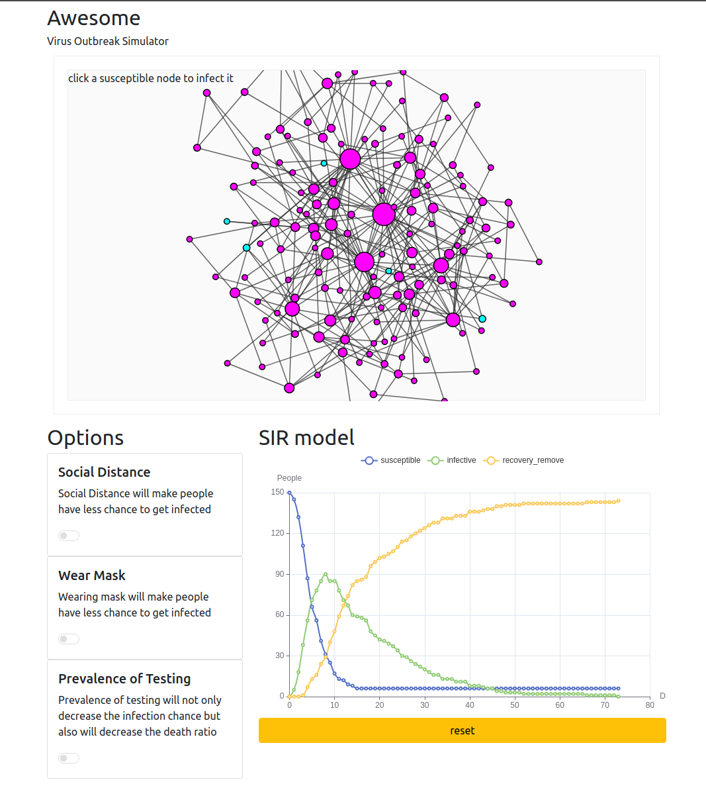
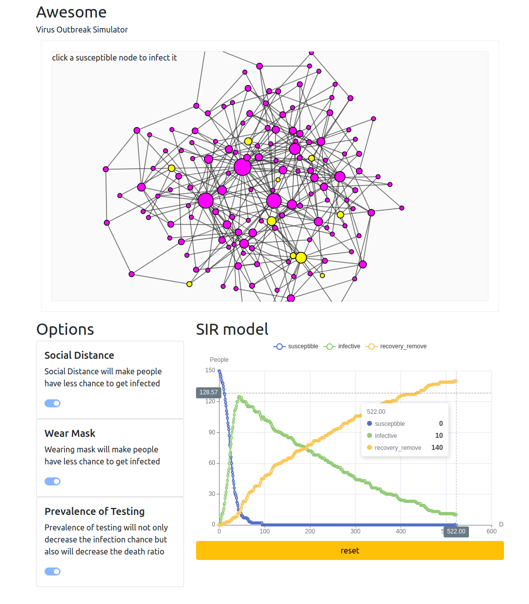

# Awesome Virus Simulator<!-- omit in toc -->

- [Visit website for simulation](#visit-website-for-simulation)
- [How it Work?](#how-it-work)
  - [Model](#model)
  - [Infrastructure](#infrastructure)
  - [AMI build](#ami-build)
  - [CICD](#cicd)
- [Concolusions:](#concolusions)
  - [Simulation results](#simulation-results)

## Visit website for simulation

[Awesome Virus Simulator](http://avs.brickea.me/simulator)

**Please use computer to visit this website since there are some touch problem for phones**

## How it Work?

### Model

Basically, this simulator was bulit by [SIR model](https://www.maa.org/press/periodicals/loci/joma/the-sir-model-for-spread-of-disease-the-differential-equation-model)

In this model 

* ```S``` represents the susceptible people; 
* ```I``` represents the infective people; 
* ```R``` represents the remove or recovered people

And there are two hyperparameters in this model

* ```r``` represents the ratio that susceptible people get infected
* ```a``` represents the ratio that the infected people get killed or recovered.

So the change rate of ```S```(Base on time ```t```) is as follow

$\frac{dS}{dt}=-rIS$

The change rate of ```I``` is as follow

$\frac{dI}{dt}=rIS-aI$

The change rate of ```R``` is as follow

$\frac{dR}{dt}=-aI$

### Infrastructure

In order to make user interface, I plan to deploy webapp in AWS.

The AWS recources were built by using [terraform](https://registry.terraform.io/providers/hashicorp/aws/latest/docs/resources/security_group)

The origin code can be found in ```infrastructure``` folder

### AMI build

I also build [AMI](https://docs.aws.amazon.com/AWSEC2/latest/UserGuide/AMIs.html) for build webapp enviorment quickly. This part can be found in ```ami``` folder.

### CICD

I also create cicd pipline to deploy the webapp code quickly to the server.

This part can be found in ```avsapp/.github/workflows``` folder

## Concolusions:

The population is 150

And these are factor for simulation:

* Social Distance: Social Distance will make people have less chance to get infected
* Wear Mask: Wearing mask will make people have less chance to get infected
* Prevalence of Testing: Prevalence of testing will not only decrease the infection chance but also will decrease the death ratio

### Simulation results


> Did not take any measures


> Social Distance


> Wear Mask


> Prevalence of Testing

Based on simulation result, we can easily find that social distance will delay the peak of infection.

Wearing a mask can reduce the highest number of infections

Prevalence of testing greatly prolongs the transition from infected people to death/recovering population, which provides greater opportunities for treatment